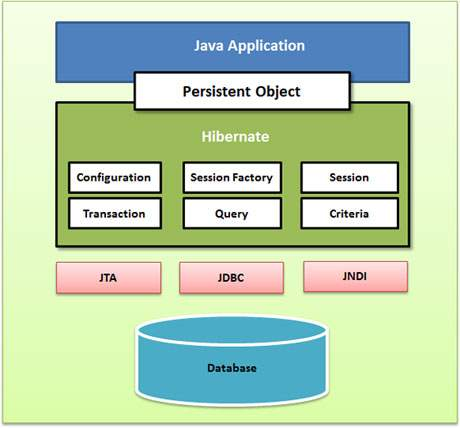

# ORM

ORM stands for Object-Relational Mapping (ORM) is a programming technique for converting data between relational
databases and object-oriented programming languages.

#### ORM is a programming technique that:

1. Maps Java objects (POJOs) to database tables
2. Allows you to interact with the database using objects, not SQL queries
3. Think of ORM as a bridge between your Java code and relational databases.

### Problems with Traditional JDBC

Using JDBC (Java Database Connectivity) directly has several limitations:

| Problem               | Description                                                         |
|-----------------------|---------------------------------------------------------------------|
| Boilerplate Code      | Repetitive code for connection, statement, and result set handling. |
| Manual Object Mapping | You need to manually convert `ResultSet` rows to Java objects.      |
| Too Much Repetition   | Similar code across all DAOs, making maintenance harder.            |
| No Caching            | JDBC doesn't cache data between queries.                            |
| Poor Transaction Mgmt | Manual `commit()` and `rollback()` calls are error-prone.           |
| No Schema Generation  | Tables must be manually created with SQL DDL scripts.               |

### Why Hibernate? (ORM Framework)

Hibernate is the most popular ORM framework for Java.

It solves the problems of JDBC by:

| Advantage                | Description                                                              |
|--------------------------|--------------------------------------------------------------------------|
| ✅ Automatic Mapping      | Maps Java classes to database tables using annotations or XML.           |
| ✅ HQL Support            | Hibernate Query Language (HQL) allows object-based querying.             |
| ✅ Less Boilerplate       | No need for repetitive JDBC code.                                        |
| ✅ Caching Support        | First-level and optional second-level caching to improve performance.    |
| ✅ Schema Generation      | Can auto-create or update DB tables based on entity classes.             |
| ✅ Transaction Management | Built-in support for clean transaction handling.                         |
| ✅ Database Independence  | Easily switch between different RDBMS (MySQL, PostgreSQL, Oracle, etc.). |

## Hibernate architecture



### 1. Configuration Object

First Hibernate object created in a typical Hibernate application.

Used only once during app initialization.

Reads configuration from:

* hibernate.cfg.xml
* hibernate.properties

🔑 **Responsibilities:**

1. Database Connection Setup via config files.
2. Class Mapping Setup – connects Java classes to DB tables.

```java
    Configuration cfg = new Configuration();
    cfg.

configure("hibernate.cfg.xml");
```

### 2. SessionFactory Object

SessionFactory object configures Hibernate for the application using the supplied configuration file and allows for a
Session object to be instantiated.

1. The SessionFactory is a thread safe object and used by all the threads of an application.
2. The SessionFactory is a heavyweight object.
3. it is usually created during application start up and kept for later use.

**You would need one SessionFactory object per database using a separate configuration file.**

So, if you are using multiple
databases, then you would have to create multiple SessionFactory objects.

```java 
StandardServiceRegistry ssr = new StandardServiceRegistryBuilder()
        .configure("hibernate.cfg.xml").build();
Metadata meta = new MetadataSources(ssr).getMetadataBuilder().build();

SessionFactory factory = meta.getSessionFactoryBuilder().build();

```

### 3. Session Object

A Session is used to get a physical connection with a database.

The Session object is lightweight and designed to be
instantiated each time an interaction is needed with the database.

Persistent objects are saved and retrieved through a
Session object.

The session objects should not be kept open for a long time because they are not usually thread safe, and they should be
created and destroyed them as needed.

    Session session = factory.openSession();

### 4. Transaction Object

A Transaction represents a unit of work with the database and most of the RDBMS supports transaction functionality.
Transactions in Hibernate are handled by an underlying transaction manager and transaction (from JDBC or JTA).

```java
    Transaction tx = session.beginTransaction();
// ... perform DB operations ...
    tx.

commit();  // or tx.rollback();
```

### 5. Query Object

Query objects use SQL or Hibernate Query Language (HQL) string to retrieve data from the database and create objects. A
Query instance is used to bind query parameters, limit the number of results returned by the query, and finally to
execute the query.

Used to run:

* HQL (Hibernate Query Language)
* Native SQL

### 6. Criteria Object (alternative to HQL)

* Used for creating object-oriented queries.
* Helps avoid HQL/SQL for dynamic queries.
* Now replaced by JPA Criteria API in newer Hibernate versions.

## Configuration

Hibernate needs mapping information to link Java classes with DB tables.

Configuration is provided via:

1. hibernate.properties (Java Properties file)
2. hibernate.cfg.xml (XML configuration file) → commonly used

Place the config file at the root of the classpath.

### Properties inside hibernate configurations

| **Property**                        | **Description**                                                                         |
|-------------------------------------|-----------------------------------------------------------------------------------------|
| `hibernate.dialect`                 | Specifies the SQL dialect Hibernate should use (e.g., MySQL, Oracle, PostgreSQL).       |
| `hibernate.connection.driver_class` | The JDBC driver class used to connect to the database.                                  |
| `hibernate.connection.url`          | JDBC URL to locate and connect to the database instance.                                |
| `hibernate.connection.username`     | Username for accessing the database.                                                    |
| `hibernate.connection.password`     | Password corresponding to the database user.                                            |
| `hibernate.hbm2ddl.auto`            | Auto schema generation: `create`, `update`, `validate`, `create-drop`, or `none`.       |
| `hibernate.show_sql`                | Displays generated SQL statements in the console (mainly for debugging).                |
| `hibernate.format_sql`              | Formats SQL output in the console to be more readable.                                  |
| `hibernate.connection.pool_size`    | Sets the number of database connections in Hibernate's internal connection pool.        |
| `hibernate.connection.autocommit`   | Enables/disables JDBC autocommit mode (set to `false` for manual transaction handling). |

### hbm2ddl.auto property :-

The hbm2ddl.auto property in Hibernate defines how your database schema is handled.

Possible values are:

| **Value**     | **Meaning**                                      |
|---------------|--------------------------------------------------|
| `create`      | Creates DB schema; drops existing tables.        |
| `update`      | Updates existing schema without data loss.       |
| `validate`    | Validates schema; throws error if mismatch.      |
| `create-drop` | Creates schema on startup; drops it on shutdown. |
| `none`        | Does nothing with schema.                        |

### hibernate Dialect

A database dialect is a configuration option that allows software to translate general SQL statements into
vendor-specific DDL and DML.

Different database products, such as PostgreSQL, MySQL, Oracle, and SQL Server, have their
own variant of SQL, which are called SQL dialects.

**common dialects**

| **Database**      | **Dialect Class**                         |
|-------------------|-------------------------------------------|
| MySQL 8.x         | `org.hibernate.dialect.MySQL8Dialect`     |
| Oracle 12c        | `org.hibernate.dialect.Oracle12cDialect`  |
| PostgreSQL        | `org.hibernate.dialect.PostgreSQLDialect` |
| H2 (in-memory DB) | `org.hibernate.dialect.H2Dialect`         |

## Object States

| **State**      | **Meaning**                                                                  | **Managed by Hibernate?** | **Stored in DB?**          |
|----------------|------------------------------------------------------------------------------|---------------------------|----------------------------|
| **Transient**  | Object is created in Java, not associated with any Hibernate `Session`.      | ❌ No                      | ❌ No                       |
| **Persistent** | Object is associated with a Hibernate `Session` and mapped to DB.            | ✅ Yes                     | ✅ Yes (after flush/commit) |
| **Detached**   | Object was persistent but the `Session` is now closed or object was evicted. | ❌ No                      | ✅ Yes (until updated)      |
| **Removed**    | Object is marked for deletion (will be deleted on `commit`).                 | ✅ Yes                     | ⚠️ Pending deletion        |

example

```

1.Transient

Student s = new Student();  // Just a POJO
    s.setName("John");          // No DB interaction
    
    2.Persistent

Session session = factory.openSession();
    session.beginTransaction();
    
    session.save(s);   // Now Hibernate tracks 's' (it's persistent)
    
    session.getTransaction().commit();
    
    3.Detached
           
    session.close();    // After session closed, 's' becomes detached
    s.setName("Updated");  // This change won’t be tracked until reattached
    
    4.Removed
    
    session.delete(s);  // Marks object as removed (still in memory until commit)

```

## Hiberante Annotations

the motive of using a hibernate is to skip the SQL part and focus on core java concepts.

Generally, in hibernate, we use
XML mapping files for converting our POJO classes data to database data and vice-versa.

But using XML becomes a little
confusing so, in replacement of using XML, we use annotations inside our POJO classes directly to declare the changes.

Also using annotations inside out POJO classes makes things simple to remember and easy to use.

Annotation is a powerful method of providing metadata for the database tables and also it gives brief information
about the database table structure and also POJO classes simultaneously.

### 1. Entity mapping annotations

| Annotation                                                          | Description                                                          | Usage Location |
|---------------------------------------------------------------------|----------------------------------------------------------------------|----------------|
| `@Entity`                                                           | Marks a class as a persistent Hibernate entity                       | Class          |
| `@Table(name = "table_name")`                                       | Maps entity to a specific database table                             | Class          |
| `@Id`                                                               | Marks a field as the primary key                                     | Field / Getter |
| `@GeneratedValue(strategy = ...)`                                   | Auto-generates primary key (`AUTO`, `IDENTITY`, `SEQUENCE`, `TABLE`) | Field / Getter |
| `@Column(name = "...", nullable = ..., unique = ..., length = ...)` | Customizes the column mapping                                        | Field / Getter |
| `@Transient`                                                        | Prevents a field from being persisted                                | Field          |
| `@Access(AccessType.FIELD/PROPERTY)`                                | Controls access strategy (field or getter/setter)                    | Field / Class  |

1. Pick one access strategy - Either all annotations on **fields** OR all on **getters**. Not mixed
2. `@Id` decides access type - If `@Id` is on getter → Hibernate uses **property access**.
3. Don’t mix annotations - If `@Id` is on a getter, put all annotations on getters (not fields).

### 2. mapping annotations

| Annotation                                                              | Description                                               | Usage Location |
|-------------------------------------------------------------------------|-----------------------------------------------------------|----------------|
| `@OneToOne`                                                             | Defines a one-to-one relationship                         | Field          |
| `@OneToMany`                                                            | Defines a one-to-many relationship                        | Field          |
| `@ManyToOne`                                                            | Defines a many-to-one relationship                        | Field          |
| `@ManyToMany`                                                           | Defines a many-to-many relationship                       | Field          |
| `@JoinColumn(name = "...")`                                             | Specifies the foreign key column                          | Field          |
| `@JoinTable(name = "...", joinColumns = ..., inverseJoinColumns = ...)` | Defines the join table for `@ManyToMany`                  | Field          |
| `@MappedBy`                                                             | Indicates the inverse (non-owning) side of a relationship | Field          |
| `@Cascade({...})`                                                       | (Hibernate-only) Controls cascading beyond standard JPA   | Field          |
| `@Fetch(FetchMode.JOIN/SELECT/SUBSELECT)`                               | (Hibernate-only) Defines fetch strategy                   | Field          |

### 3. Entity lifecycle callback annotations

| Annotation     | Description                            | Usage Location |
|----------------|----------------------------------------|----------------|
| `@PrePersist`  | Called before saving a new entity      | Method         |
| `@PostPersist` | Called after saving a new entity       | Method         |
| `@PreUpdate`   | Called before updating an entity       | Method         |
| `@PostUpdate`  | Called after updating an entity        | Method         |
| `@PreRemove`   | Called before deleting an entity       | Method         |
| `@PostRemove`  | Called after deleting an entity        | Method         |
| `@PostLoad`    | Called after entity is fetched from DB | Method         |

### 4. Fetching ,caching & optimization

| Annotation               | Description                              | Usage Location |
|--------------------------|------------------------------------------|----------------|
| `@Fetch(FetchMode.JOIN)` | (Hibernate) Customize fetch strategy     | Field          |
| `@BatchSize(size = 10)`  | (Hibernate) Controls batch fetching size | Field or Class |
| `@Cache(usage = ...)`    | (Hibernate) Enables second-level caching | Class / Field  |

### 5. Inheritance mapping annotations

| Annotation                           | Description                                         | Usage Location |
|--------------------------------------|-----------------------------------------------------|----------------|
| `@Inheritance(strategy = ...)`       | Defines inheritance strategy (`SINGLE_TABLE`, etc.) | Class          |
| `@DiscriminatorColumn(name = "...")` | Column used to distinguish subclass types           | Class          |
| `@DiscriminatorValue("...")`         | Value assigned to subclass in discriminator column  | Class          |

### more...

| Annotation                                    | Description                                          | Usage Location |
|-----------------------------------------------|------------------------------------------------------|----------------|
| `@Lob`                                        | Marks field as Large Object (`CLOB` or `BLOB`)       | Field          |
| `@Temporal(TemporalType.DATE/TIME/TIMESTAMP)` | Specifies how `Date` or `Calendar` fields are stored | Field          |
| `@Enumerated(EnumType.STRING/ORDINAL)`        | Maps enums as string or ordinal                      | Field          |
| `@Version`                                    | Enables optimistic locking                           | Field          |
| `@CreationTimestamp`                          | (Hibernate) Auto-populates timestamp on insert       | Field          |
| `@UpdateTimestamp`                            | (Hibernate) Auto-populates timestamp on update       | Field          |

## CRUD Operations in hibernate

CRUD stands for:

1. Create – Insert a new record
2. Read – Retrieve records
3. Update – Modify existing records
4. Delete – Remove records

Hibernate provides methods like **persist(), get(), update(), and delete()** to perform these operations via **ORM (
Object
Relational Mapping).**

#### 🛠 Prerequisites

* Annotated entity class (@Entity)
* Hibernate configuration (hibernate.cfg.xml) (mapping class in configurations)
* HibernateUtil class with a configured SessionFactory or create configuration object and sessionFactory object

**CREATE**
```

    Student student = new Student();
    student.setId(1);
    student.setName("Aniket");
    Transaction=null;
    
    Try(Session session = sessionFactory.openSession();)
    {
        transaction = session.beginTransaction();
        session.persist(student);
        tx.commit();
    }catch(Exception e){
    
     e.printStackTrace();
     if(transaction==null)transaction.rollback();
     
     }
    

```

**READ**

get () Returns the object if found, else null.

Use load() if you're sure the object exists (throws Exception if not).
```
    int id = 1;

    Session session = sessionFactory.openSession();
    Student student = session.get(Student.class, id);
    session.close();
    
    System.out.println(student);

```
**UPDATE**

Hibernate automatically tracks changes made inside a transaction and issues the appropriate UPDATE query.
```
    Session session = sessionFactory.openSession();
    Transaction tx = session.beginTransaction();
    
    Student student = session.get(Student.class, id);
    if (student != null) {
        student.setName("Updated Name"); // automatic dirty checking
    }
    
    tx.commit();
    session.close();

```
**DELETE**

* delete() requires a persistent object.
* Ensure the object exists before deleting.
```
    Session session = sessionFactory.openSession();
    Transaction tx = session.beginTransaction();
    
    Student student = session.get(Student.class, id);
    if (student != null) {
        session.delete(student);
    }
    
    tx.commit();
    session.close();

```
#### 🔐 Transaction Management
* Always open a Transaction for each CRUD operation.
* Commit only after operation succeeds.
* Rollback if an exception occurs.

Keep SessionFactory as a singleton or static field (use HibernateUtil).
```java
    public class HibernateUtil {
        private static SessionFactory sessionFactory;
    
        static {
            Configuration cfg = new Configuration()
                .configure("hibernate.cfg.xml")
                .addAnnotatedClass(Student.class);
            sessionFactory = cfg.buildSessionFactory();
        }
    
        public static SessionFactory getSessionFactory() {
            return sessionFactory;
        }
    }

```
### Mappings

[For Relationship Mapping click here ](src/main/java/mapping/Mappings.md)

### HQL (Hibernate Query language)
[Hql notes](src/main/java/HQL/HQL.md)