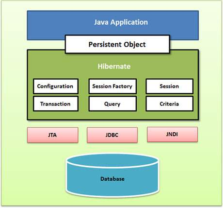

# Architecture



### 1. Configuration Object

First Hibernate object created in a typical Hibernate application.

Used only once during app initialization.

Reads configuration from:

* hibernate.cfg.xml
* hibernate.properties

🔑 **Responsibilities:**

1. Database Connection Setup via config files.
2. Class Mapping Setup – connects Java classes to DB tables.

```java
    Configuration cfg = new Configuration();
    cfg.

configure("hibernate.cfg.xml");
```

### 2. SessionFactory Object

SessionFactory object configures Hibernate for the application using the supplied configuration file and allows for a
Session object to be instantiated.

1. The SessionFactory is a thread safe object and used by all the threads of an application.
2. The SessionFactory is a heavyweight object.
3. it is usually created during application start up and kept for later use.

**You would need one SessionFactory object per database using a separate configuration file.**

So, if you are using multiple
databases, then you would have to create multiple SessionFactory objects.

```java 
StandardServiceRegistry ssr = new StandardServiceRegistryBuilder()
        .configure("hibernate.cfg.xml").build();
Metadata meta = new MetadataSources(ssr).getMetadataBuilder().build();

SessionFactory factory = meta.getSessionFactoryBuilder().build();

```

### 3. Session Object

A Session is used to get a physical connection with a database.

The Session object is lightweight and designed to be
instantiated each time an interaction is needed with the database.

Persistent objects are saved and retrieved through a
Session object.

The session objects should not be kept open for a long time because they are not usually thread safe, and they should be
created and destroyed them as needed.

    Session session = factory.openSession();

### 4. Transaction Object

A Transaction represents a unit of work with the database and most of the RDBMS supports transaction functionality.
Transactions in Hibernate are handled by an underlying transaction manager and transaction (from JDBC or JTA).

```java
    Transaction tx = session.beginTransaction();
// ... perform DB operations ...
    tx.

commit();  // or tx.rollback();
```

### 5. Query Object

Query objects use SQL or Hibernate Query Language (HQL) string to retrieve data from the database and create objects. A
Query instance is used to bind query parameters, limit the number of results returned by the query, and finally to
execute the query.

Used to run:

* HQL (Hibernate Query Language)
* Native SQL

### 6. Criteria Object (alternative to HQL)

* Used for creating object-oriented queries.
* Helps avoid HQL/SQL for dynamic queries.
* Now replaced by JPA Criteria API in newer Hibernate versions.
